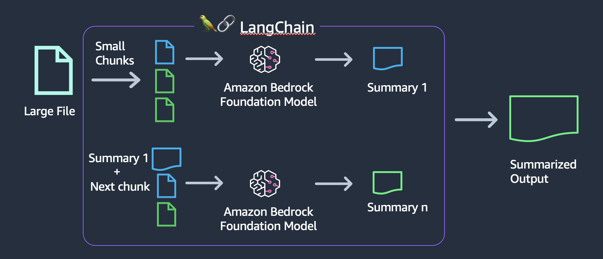

# Text summarization


## Overview

Text summarization is a Natural Language Processing (NLP) technique that involves extracting the most relevant information from a text document and presenting it in a concise and coherent format.

Summarization works by sending a prompt instruction to the model, asking the model to summarize your text, like following example:

```xml
Please summarize the following text:

<text>
Lorem ipsum dolor sit amet, consectetur adipiscing elit, 
sed do eiusmod tempor incididunt ut labore et dolore magna aliqua. 
Sem fringilla ut morbi tincidunt augue interdum velit euismod in. 
Quis hendrerit dolor magna eget est.
<text>
```

In order to get the model running a summarization task, we use a technique called prompt engineering, which sends to the model instructions (on plain text) about what is expected when it processes our data and about the response. If you would like to learn more about it, please look into [this](https://www.promptingguide.ai/).

## Why is it relevant

People in general are busy with amount of stuff to do. You have meetings to attend, articles and blogs to read, etc. Summarization is a good technique to help you be up to date with important subjects.  

In this module, you will be able to work with Amazon Bedrock API to quickly summarize small and large texts, simplifying the underneath understanding.

The idea in this demonstration is to show the art of the possible and how to replicate this example to summarize other common scenarios as:

- Academical papers
- Transcriptions:
    - After business calls
    - Call center
- Legal documentation
- Financial reports

## Target Audience

This module can be executed by any developer familiar with Python, also by data scientists and other technical people.

## Patterns

On this workshop, you will be able to learn following patterns on summarization:

1. [Text summarization with small files](./01.small-text-summarization-claude.ipynb)

    

2. [Abstractive Text Summarization](./02.long-text-summarization-titan.ipynb)

    