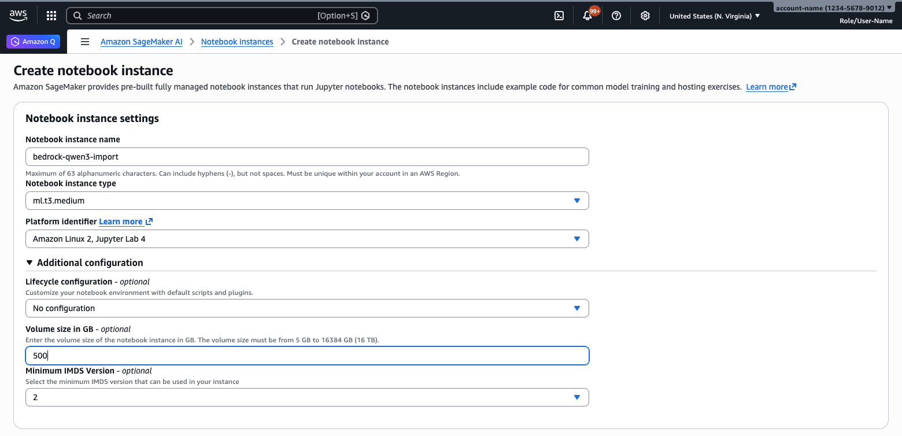

# Importing Custom Models

<!-- (Right-click "Open With > Markdown Preview" in JupyterLab to view with formatting!) -->

The samples in this folder demonstrate [importing](https://docs.aws.amazon.com/bedrock/latest/userguide/import-pre-trained-model.html) models trained or fine-tuned in other environments (like Amazon SageMaker, or models published on the [Hugging Face Hub](https://huggingface.co/models)) into Amazon Bedrock for inference.

Bedrock supports importing a range of different model architectures, as documented [here in the user guide](https://docs.aws.amazon.com/bedrock/latest/userguide/model-customization-import-model.html#model-customization-import-model-architecture).


## Common setup requirements

Although the samples have their own specifics, there are some shared requirements to be aware of when working with Custom Model Import (CMI) - discussed further below:

1. Setting up required AWS IAM [permissions](#AWS-permissions), and
2. Configuring your development/notebook [environment](#Notebook-infrastructure) to work with large model files, if necessary.


### AWS permissions

When demonstrating CMI from a notebook, there are two separate entities with AWS ([IAM](https://docs.aws.amazon.com/IAM/latest/UserGuide/introduction.html)) permissions in the process:
1. The CMI Job's [execution Role](https://docs.aws.amazon.com/IAM/latest/UserGuide/id_roles_terms-and-concepts.html#iam-term-service-role) - which Amazon Bedrock uses to access your model on S3. See the Bedrock docs on [setting up model import roles](https://docs.aws.amazon.com/bedrock/latest/userguide/model-import-iam-role.html) for more information.
2. The notebook itself - which makes AWS API calls like uploading your model to S3, managing import to Bedrock, and testing inference.
    - If you're running a notebook on SageMaker, these permissions will be defined by the associated SageMaker execution Role.
    - If you're running a notebook locally - its permissions depend on how your AWS CLI is [configured](https://docs.aws.amazon.com/cli/latest/userguide/cli-chap-authentication.html), which could be with an execution Role or an IAM User.

**For quickest setup**, you could create a SageMaker notebook environment (see the ["Notebook infrastructure" section](#notebook-infrastructure) below); let SageMaker create a new notebook execution role for you; and then add the required Bedrock [trust policy](https://docs.aws.amazon.com/IAM/latest/UserGuide/id_roles_create_for-service.html) and [permissions policy statements](https://docs.aws.amazon.com/IAM/latest/UserGuide/access_policies.html) (examples below), to that same role.

However, as a security best-practice it's preferred to keep these two roles/identities separate to minimize the access granted to each one.

#### Trust policies

Your CMI Job Role must have a [trust policy](https://aws.amazon.com/blogs/security/how-to-use-trust-policies-with-iam-roles/) that allows the Bedrock service to assume it, as documented [here in the Bedrock User Guide](https://docs.aws.amazon.com/bedrock/latest/userguide/model-import-iam-role.html#model-import-iam-role-trust).

A Role associated with a SageMaker notebook must likewise have a trust policy allowing the SageMaker service to assume it, as mentioned [here in the SageMaker AI User Guide](https://docs.aws.amazon.com/sagemaker/latest/dg/sagemaker-roles.html#sagemaker-roles-pass-role).

An example trust policy allowing **both** services (for sharing the same role between notebook and CMI job) is shown below:

```json
{
    "Version":"2012-10-17",		 	 	 
    "Statement": [
        {
            "Sid": "AssumeByBedrock",
            "Effect": "Allow",
            "Principal": {
                "Service": "bedrock.amazonaws.com"
            },
            "Action": "sts:AssumeRole",
            "Condition": {
                "StringEquals": {
                    "aws:SourceAccount": "{ACCOUNT_ID}"
                },
                "ArnEquals": {
                    "aws:SourceArn": "arn:aws:bedrock:{AWS_REGION}:{ACCOUNT_ID}:model-import-job/*"
                }
            }
        },
        {
            "Sid": "AssumeBySageMaker",
            "Effect": "Allow",
            "Principal": {
                "Service": "sagemaker.amazonaws.com"
            },
            "Action": "sts:AssumeRole"
        }
    ]
}
```


#### Permission policies

Your **Bedrock CMI Job execution Role** will need a permission policy granting access to your model files on Amazon S3, as documented [here in the Bedrock User Guide](https://docs.aws.amazon.com/bedrock/latest/userguide/model-import-iam-role.html#model-import-iam-role-s3).

For example, to grant access to pull all files from a particular S3 Bucket:

```json
{
    "Version":"2012-10-17",		 	 	 
    "Statement": [
        {
            "Sid": "GetModelArtifacts",
            "Effect": "Allow",
            "Action": [
                "s3:GetObject",
                "s3:ListBucket"
            ],
            "Resource": [
                "arn:aws:s3:::{BUCKET_NAME}",
                "arn:aws:s3:::{BUCKET_NAME}/*"
            ],
            "Condition": {
                "StringEquals": {
                    "aws:ResourceAccount": "{ACCOUNT_ID}"
                }
            }
        }
    ]
}
```

The identity associated with your **notebook environment** (SageMaker execution Role, for SageMaker notebooks, or the Role or IAM User you logged in to the AWS CLI with if running notebooks locally) will need permissions to actually manage the custom model imports - depending what you're trying to do.

The example policy below grants permissions to:
1. Upload files to your target S3 Bucket (assuming your custom model isn't there yet)
2. Fetch the status of and create Bedrock Custom Model Import jobs
3. [Pass](https://docs.aws.amazon.com/IAM/latest/UserGuide/id_roles_use_passrole.html) the Role you want Bedrock to use for the CMI Job
    - If you're sharing one IAM Role between Bedrock CMI Job and SageMaker notebook here, `IAM_ROLE_ARN` will be the same as the role you're attaching the permission to.
4. View (and optionally for clean-up, delete) imported Custom Models
5. Invoke imported custom models to check they're working

```json
{
  "Version": "2012-10-17",
  "Statement": [
    {
       "Sid": "UploadModelArtifacts",
       "Effect": "Allow",
       "Action": [
         "s3:GetObject",
         "s3:ListBucket",
         "s3:PutObject"
       ],
       "Resource": [
         "arn:aws:s3:::{BUCKET_NAME}",
         "arn:aws:s3:::{BUCKET_NAME}/*"
       ],
       "Condition": {
         "StringEquals": {
           "aws:ResourceAccount": "{ACCOUNT_ID}"
        }
      }
    },
    {
      "Sid": "BedrockCMIJobManagement",
      "Effect": "Allow",
      "Action": [
        "bedrock:CreateModelImportJob",
        "bedrock:ListModelImportJobs",
        "bedrock:GetModelImportJob"
      ],
      "Resource": "*"
    },
    {
       "Sid": "PassRoleToBedrockCMI",
       "Effect": "Allow",
       "Action": "iam:PassRole",
       "Resource": "{IAM_ROLE_ARN}",
       "Condition": {
         "StringEquals": {
           "iam:PassedToService": "bedrock.amazonaws.com"
         }
       }
    },
    {
      "Sid": "BedrockImportedModelLifecycle",
      "Effect": "Allow",
      "Action": [
        "bedrock:ListImportedModels",
        "bedrock:GetImportedModel",
        "bedrock:DeleteImportedModel"
      ],
      "Resource": [
        "arn:aws:bedrock:{AWS_REGION}:{ACCOUNT_ID}:imported-model/*"
      ]
    },
    {
      "Sid": "BedrockInvokeCustomModels",
      "Effect": "Allow",
      "Action": [
        "bedrock:InvokeModel",
        "bedrock:InvokeModelWithResponseStream"
      ],
      "Resource": [
        "arn:aws:bedrock:{AWS_REGION}:{ACCOUNT_ID}:imported-model/*",
        "arn:aws:bedrock:{AWS_REGION}:{ACCOUNT_ID}:custom-model-deployment/*"
      ]
    }
  ]
}
```


### Notebook infrastructure

Although there's generally no heavy client-side processing or GPU required to import a model to Bedrock - just an API call - it does require your model is stored on Amazon S3. Today many Foundation Models are very **large in size** (tens of Gigabytes and up)... **so in case you need to copy** your model to S3 from somewhere else (like a training server, or the Hugging Face Hub), you'll be interested to explore:
1. Optimized transfer options for fast upload and modest notebook memory/storage requirements, and
2. How to run notebooks with fast and stable network access, and large storage volumes if a full model download is required

> ℹ️ **Tips:**
> - See [qwen-3/CMI-Qwen3-HF-StreamCopy.ipynb](qwen3/CMI-Qwen3-HF-StreamCopy.ipynb) for an example copying a model from Hugging Face Hub directly to Amazon S3 without needing to store the whole model on the notebook.
> - Note the `aws s3` CLI and `upload_file{obj}` methods in boto3 automatically perform parallelized multipart uploads for large files, which substantially improves performance over the basic `PutObject` API.

Managed cloud notebooks in [Amazon SageMaker AI](https://docs.aws.amazon.com/sagemaker/latest/dg/machine-learning-environments.html) provide environments where you can run these samples with scalable infrastructure and native integration with AWS IAM permissions.


#### SageMaker Notebook Instances

**For quickest setup** if you're just looking for a basic notebook environment without the extra features of SageMaker Studio (next section), you can [create](https://console.aws.amazon.com/sagemaker/home?#/notebook-instances/create) an [Amazon SageMaker Notebook Instance](https://docs.aws.amazon.com/sagemaker/latest/dg/nbi.html).

**IF** you'll be downloading a full copy of a large model to the notebook itself, increase the **"Volume size in GB"** under "Additional configuration" to allocate sufficient disk space - as shown below:



Important tips to be aware of:
1. In our tests (on platform version `notebook-al2-v3`), running `df -h` suggested a reservation discrepancy between total and available space consistent with the 5% mentioned [here](https://unix.stackexchange.com/a/352080) - so you'll probably want to add a margin of at least 5% of model size + 2GB, if planning to save a large model on the noteboo itself.
2. The EBS volume is mounted to `/home/ec2-user/SageMaker/` (the JupyterLab root folder), so you'll need to make sure large files are saved under this folder to take advantage of the space: For example, setting your [Hugging Face cache folder](https://huggingface.co/docs/huggingface_hub/guides/manage-cache) and using the `dir` argument with [tempfile](https://docs.python.org/3/library/tempfile.html).
3. Files & folders deleted from the JupyterLab explorer UI are usually moved to trash, not deleted entirely. To free up space and permanently delete trash files, you can run `rm -rf ~/SageMaker/.Trash-1000` (and check for any other .Trash-*** files with `ls -al ~/SageMaker`).


#### SageMaker AI Studio

Alternatively, [Amazon SageMaker AI Studio](https://docs.aws.amazon.com/sagemaker/latest/dg/studio-updated.html) provides a more fully-featured, multi-user, enterprise-ready environment for ML including JupyterLab notebooks.

By default, SageMaker Studio Domains limit the maximum storage users can provision to help manage costs. You'll first need to "Edit storage settings" for your Domain in the AWS Console to allow larger EBS space storage as shown below:

")

With the limit lifted, you'll be able to create a JupyterLab space with (or edit an existing space to add) enough storage to download large models within SageMaker Studio - as shown below:

' field configured to 500")

Note that this volume is mounted to `/home/sagemaker-user/` (the JupyterLab root folder), so you'll need to make sure large files are saved under this folder to take advantage of the space: For example, setting your [Hugging Face cache folder](https://huggingface.co/docs/huggingface_hub/guides/manage-cache) and using the `dir` argument with [tempfile](https://docs.python.org/3/library/tempfile.html).

For permissions, the IAM execution Role of SageMaker Studio JupyterLab 'spaces' (notebook environments) is configured by domain administrators at either the domain level (by default) or individual user profiles (if overridden). Before adding Bedrock CMI permissions to your Studio IAM role(s), check how it will impact other users and your domain security strategy.
