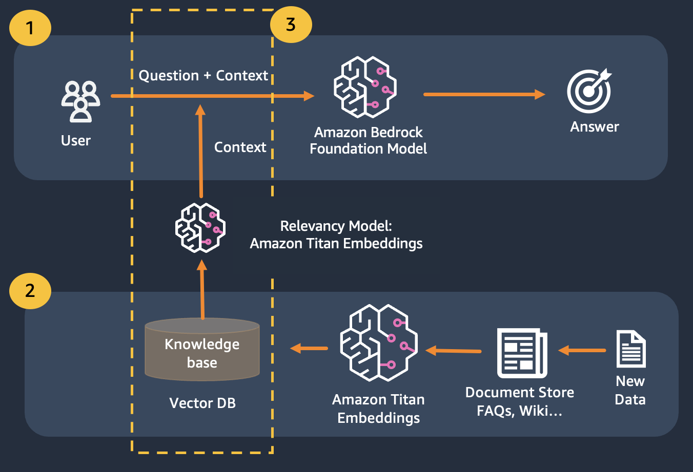

# Lab 3 - Question Answering

## Introduction

Question Answering (QA) is an important task that involves extracting answers to factual queries posed in natural language. Typically, a QA system processes a query against a knowledge base containing structured or unstructured data and generates a response with accurate information. Ensuring high accuracy is key to developing a useful, reliable and trustworthy question answering system, especially for enterprise use cases. 

Generative AI models like Amazon Titan, Anthropic Claude and AI21 Jurassic 2 use probability distributions to generate responses to questions. These models are trained on vast amounts of text data, which allows them to predict what comes next in a sequence or what word might follow a particular word. However, these models are not able to provide accurate or deterministic answers to every question because there is always some degree of uncertainty in the data. 

Enterprises need to query domain specific and proprietary data and use the information to answer questions, and more generally data on which the model has not been trained on.

## Patterns

In these labs we will explore two QA patterns:

1. First where questions are sent to the model where by we will get answers based on the base model with no modifications.
This poses a challenge,
outputs are generic to common world information, not specific to a customers specific business, and there is no source of information.

    

2. The Second Pattern where we use Retrieval Augmented Generation which improves upon the first where we concatenate our questions with as much relevant context as possible, which is likely to contain the answers or information we are looking for.
The challenge here, There is a limit on how much contextual information can be used is determined by the token limit of the model.
    

This can be overcome by using Retrival Augmented Generation (RAG) 

## How Retrieval Augmented Generation (RAG) works

RAG combines the use of embeddings to index the corpus of the documents to build a knowledge base and the use of an LLM to extract the information from a subset of the documents in the knowledge base. 

As a preparation step for RAG, the documents building up the knowledge base are split in chunks of a fixed size (matching the maximum input size of the selected embedding model), and are then passed to the model to obtain the embedding vector. The embedding together with the original chunk of the document and additional metadata are stored in a vector database. The vector database is optimized to efficiently perform similarity search between vectors.

## Target audience
Customers with data stores that may be private or frequently changing. RAG approach solves 2 problems, customers having the following challenges can benefit from this lab.
- Freshness of data: if the data is continously changing and model must only provide latest information.
- Actuality of knowledge: if there is some domain specific knowledge that model might not have understanding of, and the model must output as per the domain data.

## Objective

After this module you should have a good understanding of:

1. What is the QA pattern and how it leverages Retrieval Augmented Generation (RAG)
2. How to use Bedrock to implement a Q&A RAG solution

In this module we will walk you through how to implement the QA pattern with Bedrock. 
Additionally, we have prepared the embeddings to be loaded in the vector database for you. 

Take note you can use Titan Embeddings to obtain the embeddings of the user question, then use those embedding to retrieve the most relevant documents from the vector database, build a prompt concatenating the top 3 documents and invoke the LLM model via Bedrock.

## Setup
Before running any of the labs in this section ensure you've run the [Bedrock boto3 setup notebook](../00_Intro/bedrock_boto3_setup.ipynb#Prerequisites).

## Notebooks

1. [Q&A with model knowledge and small context](./00_qa_w_bedrock_titan.ipynb)

1. [Q&A with RAG](./01_qa_w_rag_claude.ipynb)

1. [Q&A with RAG and Pinecone](./02_qa_w_rag_claude_pinecone.ipynb)