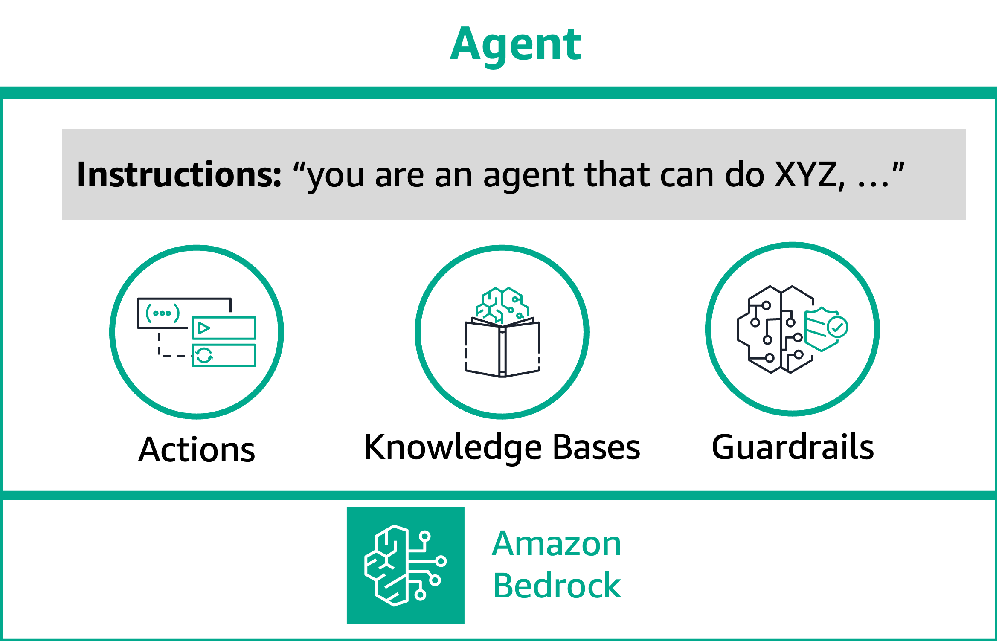
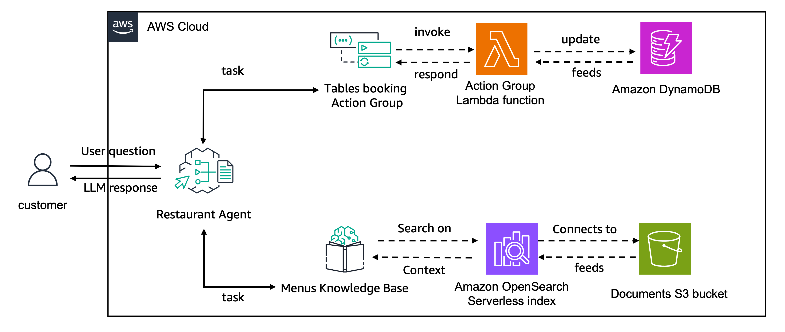

# Lab 7 - Agents for Bedrock

## Overview

In this lab, you will learn about [Agents for Amazon Bedrock](https://aws.amazon.com/bedrock/agents/), 
an [Amazon Bedrock](https://aws.amazon.com/bedrock/) capability that lets you harness the Foundation Model's (FM's) 
reasoning skills to execute multi-steps business tasks using natural language. You can simply state your problem, 
like “help me update my product catalogue” and the agent breaks down the problem using the FM’s reasoning capabilities 
and executes the steps to fulfill your request. You set up an agent with access to your organization’s enterprise systems, 
processes, knowledge bases, and some building block functions. Then the agent comes up with the logic, figures out what APIs 
to call and when to call them, and completes the transactions in the right sequence. When an agent needs a piece of information 
from the user, it automatically asks the user for those additional details using natural language. And the best part about agents — 
it’s leveraging the most up-to-date information you have and gives you relevant answers securely and privately. 

An agent consists of the following components:

* **Foundation model** – You choose a foundation model that the agent invokes to interpret user input and subsequent prompts in its orchestration process, and to generate responses and follow-up steps in its process.
* **Instructions** – You write up instructions that describe what the agent is designed to do. With advanced prompts, you can further customize instructions for the agent at every step of orchestration and include Lambda functions to parse the output of each step.
* **(Optional) Action groups** – You define the actions that the agent can help the user performing. An action group is composed of actions and the action executor. You can define actions by passing the function details via JSON object or using an API Schema file. You can execute the actions using a Lambda function, or you can return the control to the application and handle the function execution outside of Agents.
* **(Optional) Knowledge bases for Amazon Bedrock** – Associate [Knowledge bases for Amazon Bedrock](https://docs.aws.amazon.com/bedrock/latest/userguide/knowledge-base.html) with an agent to allow it to query the knowledge base for extra context to augment response generation and input into steps of the orchestration process.
* **(Optional) Guardrails for Amazon Bedrock** Associate [Guardrails for Amazon Bedrock](https://docs.aws.amazon.com/bedrock/latest/userguide/guardrails.html) with an agent to safeguard your Agent based on use cases and Responsible AI policies

The following image schematizes the components of your agent.

In build-time, all these components are gathered to construct base prompts for the agent in order to carry out orchestration until the user request is completed. With advanced prompts, you can modify these base prompts with additional logic and few-shot examples to improve accuracy for each step of agent invocation. The base prompt templates contain instructions, action descriptions, knowledge base descriptions, and conversation history, all of which you can customize to modify the agent to the best of your needs. You then prepare your agent, which packages all the components of the agents, including security configurations, and brings the agent into a state where it is ready for testing in runtime.

## Audience

Architects, data scientists and developer who want to learn how to use Agents for Amazon Bedrock to create generative AI applications. 
From the simplest instruction only agent to complex assistants that combine Action Groups with Knowledge Bases, you can use the power of agents to quickly develop your Generative API application.

## Workshop Notebooks
During this workshop, you will cover three modules:

1. **Building Agents for Bedrock using Boto3 SDK**: In this module, you will create agents for Bedrock programmatically using the restaurant agent example. This module uses the `01_create_agent.ipynb` file
2. **Integrating Knowledge Bases to your Agents**: In this module, you will create a Knowledge Base and update your restaurant agent to connect this knowledge via Boto3 SDK. This module uses the `02_associate_knowledge_base_to_agent.ipynb` file
3. **Test your Agent**: In this module, you will invoke your agent with different prompts. This module uses the `03_invoke_agent.ipynb` file 
4. **Clean up Resources**: In the last module you will dissociate all resources from your agent and delete them. This module uses the `04_clean_up_agent_resources.ipynb` file

## Setup
Before running any of the labs in this section ensure you've installed the requirements from `requirements.txt` file.

## Architecture
In this lab we will create a restaurant assistant agent that connects with a Knowledge Base for Amazon Bedrock containing the restaurant's different menus.
This agent also connects to an action group that provides functionalities for handling the table booking in this restaurant.

The action group created in this example, uses Feature Definition to define the functionalities for `create_booking`, `get_booking_details` and `delete_booking`.
The action group execution connects with a Lambda function that interacts with an Amazon DynamoDB table.

## Agents deep dive workshop
The Agents for Amazon Bedrock labs in this workshop provide a high-level overview of the Agents content.
For a deep dive into Agents concepts, including concepts such as return of control, advanced prompts and others, you can check the [Agents for Amazon Bedrock Workshop](https://catalog.workshops.aws/agents-for-amazon-bedrock/en-US)