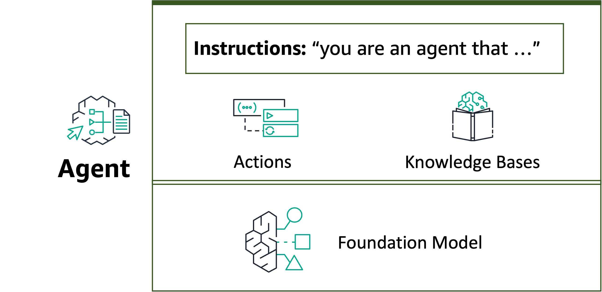

# Lab 5 - Agents for Bedrock

## Overview

In this lab, you will learn about [Agents for Amazon Bedrock](https://aws.amazon.com/bedrock/agents/), a new [Amazon Bedrock](https://aws.amazon.com/bedrock/) capability that lets you harness the Foundation Model's (FM's) reasoning skills to execute multi-steps business tasks using natural language. You can simply state your problem, like “help me update my product catalog” and the agent breaks down the problem using the FM’s reasoning capabilities and executes the steps to fulfill your request. You set up an agent with access to your organization’s enterprise systems, processes, knowledge bases, and some building block functions. Then the agent comes up with the logic, figures out what APIs to call and when to call them, and completes the transactions in the right sequence. When an agent needs a piece of information from the user, it automatically asks the user for those additional details using natural language. And the best part about agents — it’s leveraging the most up-to-date information you have and gives you relevant answers securely and privately. 

An agent consists of the following components:

* **Foundation model** – You choose a foundation model that the agent invokes to interpret user input and subsequent prompts in its orchestration process, and to generate responses and follow-up steps in its process.
* **Instructions** – You write up instructions that describe what the agent is designed to do. With advanced prompts, you can further customize instructions for the agent at every step of orchestration and include Lambda functions to parse the output of each step.
* **(Optional) Action groups** – You define the actions that the agent should carry out by providing two resources:

  * An OpenAPI schema to define the APIs that the agent can invoke to carry out its tasks.
  * A Lambda function with the following input and output.

     * Input – The API and parameters identified during orchestration.
     * Output – The result of the API invocation.
      
* **(Optional) Knowledge bases** – Associate knowledge bases with an agent to allow it to query the knowledge base for extra context to augment response generation and input into the steps of the orchestration process.

The following image schematizes the components of your agent.

At build-time, all these components are gathered to construct base prompts for the agent in order to carry out orchestration until the user request is completed. With advanced prompts, you can modify these base prompts with additional logic and few-shot examples to improve accuracy for each step of agent invocation. The base prompt templates contain instructions, action descriptions, knowledge base descriptions, and conversation history, all of which you can customize to modify the agent to the best of your needs. You then prepare your agent, which packages all the components of the agents, including security configurations, and brings the agent into a state where it is ready for testing at runtime.

## Audience

Architects, data scientists and developer who want to learn how to use Agents for Amazon Bedrock to create generative AI applications. 
From the simplest instruction only agent to complex assistants that combine Action Groups with Knowledge Bases, you can use the power of agents to quickly develop your Generative API application.

## Workshop Notebooks
During this workshop, you will cover two modules:

1. **Building Agents for Bedrock using Boto3 SDK**: In this module, you will create agents for Bedrock programmatically using the insurance claim agent example. The files for this module are available in the `insurance_claims_agent/without_kb` folder
2. **Integrating Knowledge Bases to your Agents**: In this module, you will create and integrate a Knowledge Base to your insurance claims agent via Boto3 SDK. The files for this module are available in the `insurance_claims_agent/with_kb` folder.

## Setup
Before running any of the labs in this section ensure you've run the [Bedrock boto3 setup notebook](../00_Intro/bedrock_boto3_setup.ipynb#Prerequisites).

## Architectures

**Building Agents for Bedrock using Boto3 SDK**

**Integrating Knowledge Bases to your Agents**
