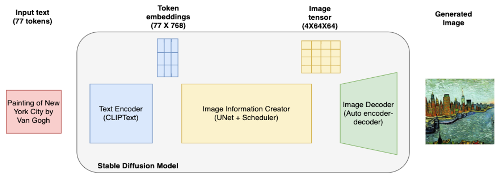
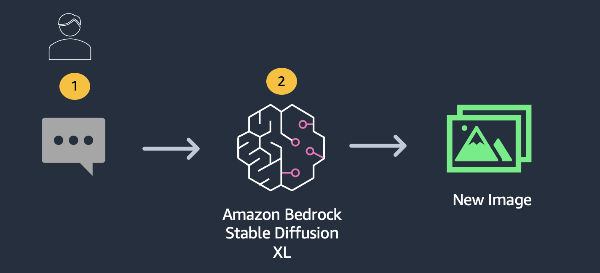
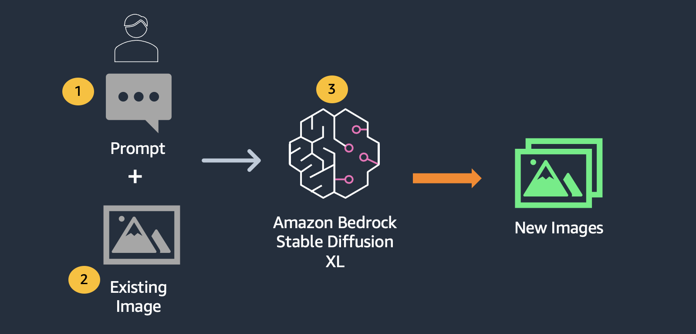

# ラボ 5 - Image (画像生成)

### 概要

画像生成は、画像を利用して自分の考えを説明するアーティスト、デザイナー、コンテンツクリエーターにとっては面倒な作業です。基盤モデル (FM) を使えば、この面倒な作業をアーティストの考えを表現する一行のテキストにまとめることができます。FM を使うと、言語プロンプトからさまざまな主題、環境、シーンのリアルで芸術的な画像を作成できます。

このラボでは、Amazon Bedrock で利用できる基盤モデルを使用してイメージを生成する方法と、既存のイメージを変更する方法を探ります。

### 画像プロンプト

良いプロンプトを書くことは、時には芸術にもなり得ます。特定のプロンプトが特定のモデルで満足のいくイメージをもたらすかどうかを予測するのは難しいことがよくあります。ただし、機能することが確認されているテンプレートもあります。プロンプトは大まかに言うと、(i) 画像のタイプ (写真、スケッチ、絵画など)、(ii) 説明 (被写体、オブジェクト、環境、シーンなど)、(iii) イメージのスタイル (リアリスティック/芸術/アートのタイプなど) の3つに分類できます。3 つのパーツをそれぞれ個別に変更して、画像のバリエーションを生成できます。形容詞は画像生成プロセスにおいて重要な役割を果たすことが知られています。また、詳細を追加すると生成プロセスに役立ちます。リアルな画像を生成するには、「の画像」、「の写真」、「リアリスティック」、「ハイパーリアリスティック」などのフレーズを使用できます。

アーティストによる画像を生成するには、「パブロ・ピカソ作」、「レンブラントの油絵」、「フレデリック・エドウィン・チャーチの風景画」、「アルブレヒト・デューラーの鉛筆画」などのフレーズを使用できます。異なるアーティストを組み合わせることもできます。カテゴリー別にアーティスティックなイメージを生成するには、プロンプトに「浜辺のライオン、抽象」のようにアートカテゴリーを追加します。その他のカテゴリには、「油絵」、「鉛筆画」、「ポップアート」、「デジタルアート」、「アニメ」、「漫画」、「未来派」、「水彩」、「マンガ」などがあります。35 mm ワイドレンズや 85 mm ワイドレンズなどの照明やカメラレンズなどの詳細や、フレーミングに関する詳細（ポートレート/風景/クローズアップなど）を含めることもできます。

同じプロンプトが複数回与えられても、モデルは異なる画像を生成することに注意してください。そのため、複数の画像を生成して、アプリケーションに最適な画像を選択できます。

## 基盤モデル

この機能を提供するために、Amazon Bedrock は Stability AI からイメージを生成するための独自の基盤モデル [Stable Diffusion XL](https://stability.ai/stablediffusion) をサポートしています。Stable Diffusion は拡散の原理に基づいて動作し、それぞれ目的が異なる複数のモデルで構成されています。

1.  CLIP テキストエンコーダー
2.  VAE デコーダー
3.  UNet
4.  VAE_Post_Quant_Conv

動作は次のアーキテクチャで説明できます。

## 対象読者

マーケティング会社、エージェンシー、ウェブデザイナー、一般企業はこの機能を活用して、まったく新しい画像をゼロから生成できます。

## パターン

このワークショップでは、テキストまたは画像入力から始めて、Amazon Bedrock を使用した画像生成について学ぶことができます。

1.  [テキストから画像へ](./Bedrock%20Stable%20Diffusion%20XL.ja.ipynb)
    
2.  [イメージからイメージへ (インペイント)](./Bedrock%20Stable%20Diffusion%20XL.ja.ipynb)
    

## ヘルパー

画像の生成を容易にするために、`/utils/bedrock.py` にはユーティリティクラス `Bedrock` が実装されています。これにより、イメージを簡単に生成できます。

さまざまな `style_preset` オプション [ここに](https://platform.stability.ai/docs/features/animation/parameters#available-styles) を調べることもできます。
