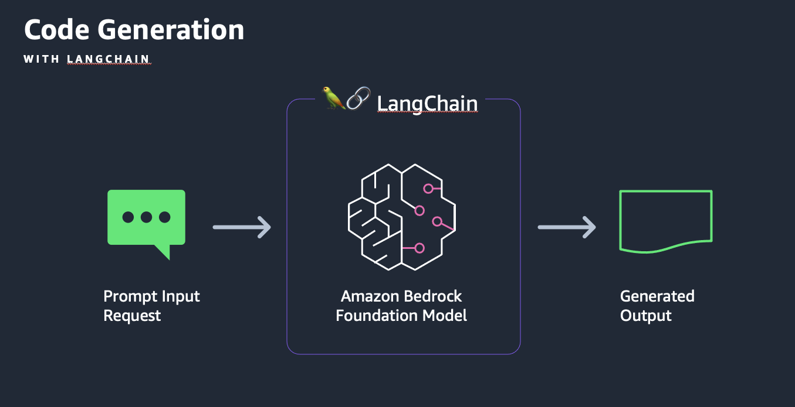

# ラボ 6 - Code Generation (コード生成)

## 概要

このラボでは、Amazon Bedrock 上の LLM を使って、コード生成、SQL クエリ作成、コード説明、言語間でのコード変換を学びます。Bedrock の API（boto3）と LangChain との統合をデモします。

まず、データセットに関するコンテキストを提供することで、Python コードと SQL クエリを生成します。次に、コードの説明と言語間の翻訳を行います。これらのユースケースを Bedrock API を直接使用する場合と、 LangChain を統合する場合の両方で探ります。

## 対象読者

Amazon Bedrock LLM を使ってコードを生成、説明、翻訳する方法を学びたいアーキテクトや開発者。
 
コード生成のビジネスユースケースには次のようなものがあります:

- コード翻訳
- コード解説とレビュー
- データベースまたは SQL クエリの生成
- 迅速なプロトタイピング
- 問題の特定
- バグ修正
- コード最適化

## Workshop ノートブック

1. [コード生成](./00_code_generatation_w_bedrock.ja.ipynb)- 自然言語を使用して Python コードを生成する方法を示します。データアナリストが与えられた売上 CSV データセットに対して売上分析を実行するために、Python で簡単な関数、クラス、完全なプログラムを生成するプロンプトの例を示します。

2. [Database or SQL Query Generation](./01_sql_query_generate_w_bedrock.ja.ipynb) - Amazon Bedrock API を使った SQL クエリの生成に焦点を当てています。与えられたデータセットとデータベーススキーマに対して、単純な SQL 文と複雑な SQL 文の両方を生成する例が含まれています。

3. [Code Explanation](./02_code_interpret_w_langchain.ja.ipynb) - Bedrockの基礎モデルを使って、複雑な C++ コード・スニペットの説明を生成します。複雑な C++ コード例の機能やロジックを説明するコメントやドキュメントを生成するために、プロンプトを入念に作成する方法を示しています。プロンプトは、他のプログラミング言語用に簡単に更新することができます。

4. [Code Translation ](./03_code_translate_w_langchain.ja.ipynb) - Amazon Bedrock と LangChain API を使用して、C++ コードを Java に変換する方法を説明します。言語間の構文、言語構成、規約の違いを扱いながら、C++ コードを Java に移植するプロンプトのテクニックを示します。

## アーキテクチャ

