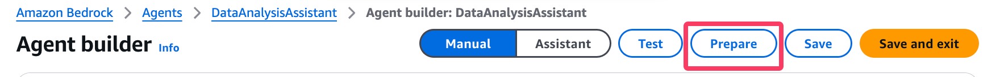

# Creating an AI agent with code interpretation capabilities using the Amazon Bedrock console

This guide walks you through the process of creating an AI agent with code interpretation capabilities using the Amazon Bedrock console. This agent will be able to perform data analysis tasks and generate visualizations.

## Prerequisites

- An AWS account with access to Amazon Bedrock
- Familiarity with the AWS Management Console

## Step-by-Step Instructions

### 1. Access Amazon Bedrock Console

- Sign in to the AWS Management Console
- Navigate to the Amazon Bedrock service
- Select "Agents" from the left navigation pane


### 2. Create a New Agent

- Click on "Create Agent"
- Provide a name for your agent "DataAnalysisAssistant"
- Add a description (Optional) - "AI Agent with Code Interpreter enabled for Data analysis"
- Click "Create"


### 3. Configure Agent Details

- In the Agent builder, go to the "Agent details" section
- For "Agent resource role", select "Create and use a new service role"
- Choose a foundation model optimized for agents (e.g., Claude 3.5 Sonnet v2)
- In "Instructions for the Agent", enter:
```
You are an AI assistant specialized in data analysis and visualization. You can write, run, and debug Python code to help users with their queries. Always provide clear explanations of your process and results.
```


### 4. Enable Code Interpreter

- Expand "Additional settings"
- Find "Code Interpreter" and toggle it on

### 5. Configure User Input Settings

- In the same "Additional settings" section, ensure "User input" is enabled


### 6. Review and Save Agent Configuration

- Review all settings to ensure they're correct
- Click "Save" to apply your configurations


### 7. Prepare the Agent

- After saving, click on "Prepare" to make the agent ready for testing
- Wait for the preparation process to complete



### 8. Test the Agent

- Once prepared, use the test window (on the right side panel) to interact with your agent
- Try the following prompt to test the code interpreter:

```
Using the customer satisfaction data provided below, create a bar graph showing the average overall rating for each hotel (H001, H002, H003). The graph should have the hotel IDs on the x-axis and the average overall rating on the y-axis.

date,hotel_id,overall_rating,room_cleanliness,staff_service,amenities,value_for_money,location
2023-01-05,H001,4.2,4.5,4.0,3.8,4.1,4.5
2023-01-12,H002,3.8,4.0,3.5,3.9,3.7,4.2
2023-01-20,H003,4.5,4.7,4.6,4.3,4.2,4.8
2023-02-03,H001,3.9,4.2,3.7,3.6,3.8,4.4
2023-02-15,H002,4.1,4.3,4.0,4.1,3.9,4.3
2023-02-28,H003,4.3,4.5,4.4,4.2,4.0,4.6
2023-03-10,H001,4.0,4.3,3.8,3.7,3.9,4.5
2023-03-22,H002,3.7,3.9,3.6,3.8,3.5,4.1
2023-04-05,H003,4.4,4.6,4.5,4.1,4.1,4.7
2023-04-18,H001,4.1,4.4,3.9,3.8,4.0,4.6
2023-05-01,H002,3.9,4.1,3.8,4.0,3.6,4.2
2023-05-15,H003,4.6,4.8,4.7,4.4,4.3,4.9
2023-06-02,H001,4.3,4.6,4.1,4.0,4.2,4.7
2023-06-20,H002,4.0,4.2,3.9,4.1,3.8,4.3
2023-06-30,H003,4.5,4.7,4.6,4.3,4.2,4.8
```


### 9. Review and Iterate

- Analyze the agent's responses, code outputs, and generated visualizations
- If necessary, adjust the agent's instructions or settings and prepare again


### 9. Additional prompt testing
- Perform testing with below prompts for additional analysis and visualizations 
Using the customer satisfaction data provided above, perform the following tasks:
	1.	Create a bar graph showing the average overall rating for each hotel (H001, H002, H003). The graph should have the hotel IDs on the x-axis and the average overall rating on the y-axis.
	2.	Generate a heatmap that displays the correlation between different satisfaction factors (room_cleanliness, staff_service, amenities, value_for_money, location) and the overall_rating.
	3.	Calculate and print the average scores for each satisfaction factor across all hotels.
	4.	Identify the hotel with the highest average overall rating and provide its average scores for each satisfaction factor.
	5.	Create a line graph showing the trend of overall ratings over time for each hotel.
	6.	Ensure that all graphs are clearly labeled and easy to read. After generating the visualizations and performing the analysis, provide a brief interpretation of the results, highlighting key findings and any notable trends or patterns in the data.

## Conclusion

By following these steps, you've created an AI agent capable of performing data analysis tasks using the Code Interpreter tool directly through the Amazon Bedrock console. This agent can help with various data processing, analysis, and visualization tasks, making it a powerful tool for data-driven decision making.


