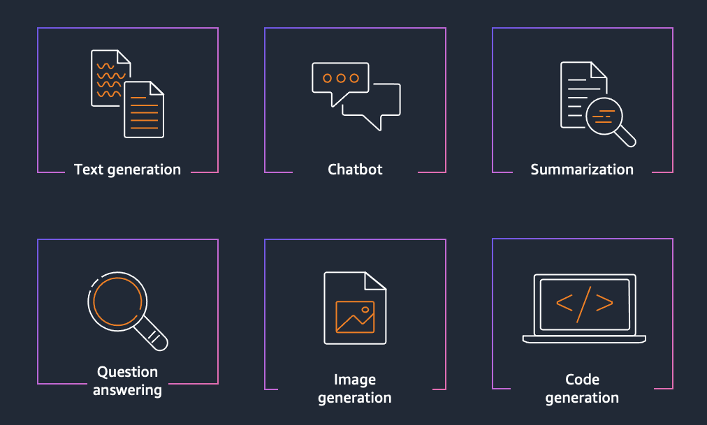

# Amazon Bedrock Workshop

This hands-on workshop, aimed at developers and solution builders, introduces how to leverage foundation models (FMs) through [Amazon Bedrock](https://aws.amazon.com/bedrock/).

Amazon Bedrock is a fully managed service that provides access to FMs from third-party providers and Amazon; available via an API. With Bedrock, you can choose from a variety of models to find the one that’s best suited for your use case.

Within this series of labs, you'll explore some of the most common usage patterns we are seeing with our customers for Generative AI. We will show techniques for generating text and images, creating value for organizations by improving productivity. This is achieved by leveraging foundation models to help in composing emails, summarizing text, answering questions, building chatbots, and creating images. While the focus of this workshop is for you to gain hands-on experience implementing these patterns via Bedrock APIs and SDKs, you will also have the option of exploring integrations with open-source packages like [LangChain](https://python.langchain.com/docs/get_started/introduction) and [FAISS](https://faiss.ai/index.html).

Labs include:

- **01 - Text Generation** \[Estimated time to complete - 45 mins\]
    - Text generation with Bedrock
    - Text summarization with Titan and Claude
    - QnA with Titan
    - Entity extraction
- **02 - Knowledge bases and RAG** \[Estimated time to complete - 45 mins\]
    - Managed RAG retrieve and generate example
    - Langchain RAG retrieve and generate example
- **03 - Model customization** \[Estimated time to complete - 30 mins\]
    - Coming soon
- **04 - Image and Multimodal** \[Estimated time to complete - 30 mins\]
    - Bedrock Titan image generator
    - Bedrock Stable Diffusion XL
    - Bedrock Titan Multimodal embeddings
- **05 - Agents** \[Estimated time to complete - 30 mins\]
    - Customer service agent
    - Insurance claims agent
- **06 - Open source examples (optional)** \[Estimated time to complete - 30 mins\]
    - Langchain Text Generation examples
    - Langchain KB RAG examples
    - Langchain Chatbot examples
    - NVIDIA NeMo Guardrails examples
    - NodeJS Bedrock examples

<div align="center">



</div>

You can also refer to these [Step-by-step guided instructions on the workshop website](https://catalog.us-east-1.prod.workshops.aws/workshops/a4bdb007-5600-4368-81c5-ff5b4154f518/en-US).


## Getting started

### Choose a notebook environment

This workshop is presented as a series of **Python notebooks**, which you can run from the environment of your choice:

- For a fully-managed environment with rich AI/ML features, we'd recommend using [SageMaker Studio](https://aws.amazon.com/sagemaker/studio/). To get started quickly, you can refer to the [instructions for domain quick setup](https://docs.aws.amazon.com/sagemaker/latest/dg/onboard-quick-start.html).
- For a fully-managed but more basic experience, you could instead [create a SageMaker Notebook Instance](https://docs.aws.amazon.com/sagemaker/latest/dg/howitworks-create-ws.html).
- If you prefer to use your existing (local or other) notebook environment, make sure it has [credentials for calling AWS](https://docs.aws.amazon.com/cli/latest/userguide/cli-chap-configure.html).


### Enable AWS IAM permissions for Bedrock

The AWS identity you assume from your notebook environment (which is the [*Studio/notebook Execution Role*](https://docs.aws.amazon.com/sagemaker/latest/dg/sagemaker-roles.html) from SageMaker, or could be a role or IAM User for self-managed notebooks), must have sufficient [AWS IAM permissions](https://docs.aws.amazon.com/IAM/latest/UserGuide/access_policies.html) to call the Amazon Bedrock service.

To grant Bedrock access to your identity, you can:

- Open the [AWS IAM Console](https://us-east-1.console.aws.amazon.com/iam/home?#)
- Find your [Role](https://us-east-1.console.aws.amazon.com/iamv2/home?#/roles) (if using SageMaker or otherwise assuming an IAM Role), or else [User](https://us-east-1.console.aws.amazon.com/iamv2/home?#/users)
- Select *Add Permissions > Create Inline Policy* to attach new inline permissions, open the *JSON* editor and paste in the below example policy:

```
{
    "Version": "2012-10-17",
    "Statement": [
        {
            "Sid": "BedrockFullAccess",
            "Effect": "Allow",
            "Action": ["bedrock:*"],
            "Resource": "*"
        }
    ]
}
```

> ⚠️ **Note:** With Amazon SageMaker, your notebook execution role will typically be *separate* from the user or role that you log in to the AWS Console with. If you'd like to explore the AWS Console for Amazon Bedrock, you'll need to grant permissions to your Console user/role too. You can run the notebooks anywhere as long as you have access to the AWS Bedrock service and have appropriate credentials

For more information on the fine-grained action and resource permissions in Bedrock, check out the Bedrock Developer Guide.


### Clone and use the notebooks

> ℹ️ **Note:** In SageMaker Studio, you can open a "System Terminal" to run these commands by clicking *File > New > Terminal*

Once your notebook environment is set up, clone this workshop repository into it.

```sh
sudo yum install -y unzip
git clone https://github.com/aws-samples/amazon-bedrock-workshop.git
cd amazon-bedrock-workshop
```


You're now ready to explore the lab notebooks! Start with [00_Prerequisites/bedrock_basics.ipynb](00_Prerequisites/bedrock_basics.ipynb) for details on how to install the Bedrock SDKs, create a client, and start calling the APIs from Python.
